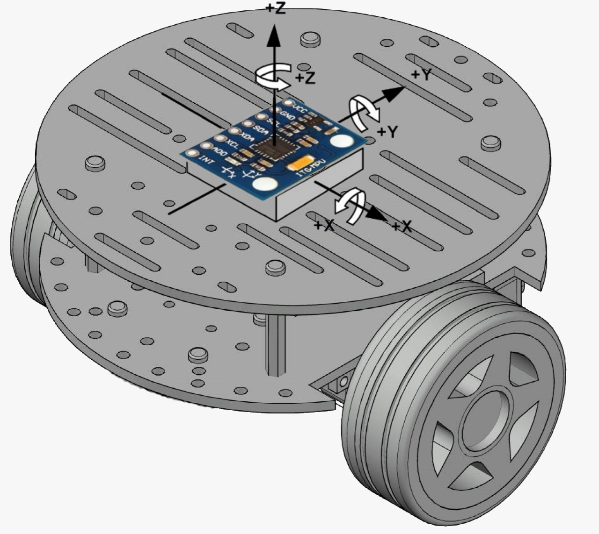

# seesaw-ugv
Robot péndulo invertido en configuración diferencial, con ESP8266

## Esquema Mecánico del robot

    

        
    

El esquema muestra la disposición mecánica del robot, junto con los ejes que maneja el sensor MPU. En esta configuración el robot tiene el eje longitudinal en el Eje Y del sensor y el eje transversal en el Eje X.

## Versión Actual 1.9
En esta versión se realizaron los siguientes cambios:
1. Se utiliza el valor que obtiene el giroscopio de la velocidad angular para mejorar la precisión de la señal de error que controla el robot.
2. Tambien se utiliza una nueva función para mejorar la operación de los motores dentro de los rangos útiles del PWM, tanto para avanzar como para retroceder.
3. Se probaron mejores constantes para la señal de control y se decidió por un control PI.